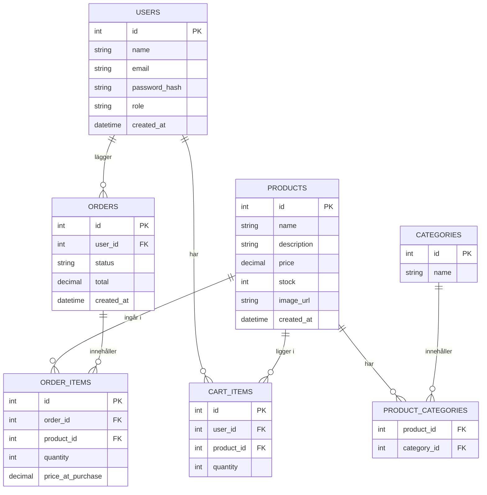

# Databasdiagram

```mermaid
erDiagram
    USERS ||--o{ ORDERS : "lägger"
    USERS ||--o{ CART_ITEMS : "har"
    PRODUCTS ||--o{ ORDER_ITEMS : "ingår i"
    PRODUCTS ||--o{ CART_ITEMS : "ligger i"
    PRODUCTS ||--o{ PRODUCT_CATEGORIES : "har"
    CATEGORIES ||--o{ PRODUCT_CATEGORIES : "innehåller"
    ORDERS ||--o{ ORDER_ITEMS : "innehåller"

    USERS {
        int id PK
        string name
        string email
        string password_hash
        string role
        datetime created_at
    }

    CATEGORIES {
        int id PK
        string name
    }

    PRODUCTS {
        int id PK
        string name
        string description
        decimal price
        int stock
        string image_url
        datetime created_at
    }

    PRODUCT_CATEGORIES {
        int product_id FK
        int category_id FK
    }

    ORDERS {
        int id PK
        int user_id FK
        string status
        decimal total
        datetime created_at
    }

    ORDER_ITEMS {
        int id PK
        int order_id FK
        int product_id FK
        int quantity
        decimal price_at_purchase
    }

    CART_ITEMS {
        int id PK
        int user_id FK
        int product_id FK
        int quantity
    }
```

